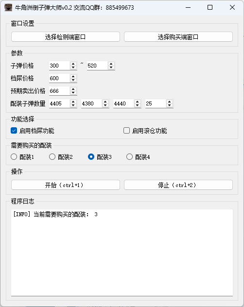

# 三角洲双端滚仓倒子弹工具


## 介绍

### 交流 QQ 群： 885499673，内附使用教程
### 功能
- 支持期望购买价格
- 支持期望卖出价格
- 支持档屎
- 支持滚仓自动卖子弹
- 使用 PyQt5 实现图形化界面

## 使用方法

> python 版本要求 3.10 以上

### 安装依赖
```bash
pip install -r requirements.txt
```

### 运行
```bash 
python main.py
```

### 构建
```bash
pyinstaller --name "牛角洲倒子弹大师" --add-data ".\*.ini;." --add-data ".\resources;resources" --icon ".\resources\images\favicon.ico" --windowed --noconfirm --additional-hooks .\hooks --collect-all paddle --collect-all paddleocr --collect-all tqdm .\main.py
```

## 软件截图


## 免责声明
本软件仅供学习交流使用，禁止用于任何商业用途。使用本软件所产生的任何后果与作者无关。请在法律允许的范围内使用本软件，遵守相关法律法规。

## 捐助

如果你觉得本项目对你有帮助，可以考虑捐助我，支持我继续开发和维护这个项目。

